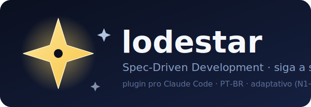
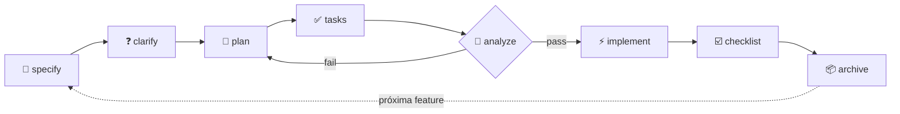

<div align="center">




### A spec é a estrela que guia o seu projeto no desenvolvimento com IA.

**Spec-Driven Development (SDD) como _plugin_ do [Claude Code](https://claude.com/claude-code).**
Instala, roda `/lodestar:init` e começa a codar com IA **sem perder o controle do que ela faz**.

<br>


</div>

---

> **TL;DR** — Vibecoding sem rumo gera código que parece certo e desanda quando o projeto cresce.
> O `lodestar` faz a IA implementar **contra uma spec que é a lei**, não contra a própria imaginação.
> Funciona em micro-app e em sistema multi-tenant — ele se adapta (3 níveis).

---

## 📑 Sumário

- [Instalação](#-instalação)
- [Por que existe](#-por-que-existe)
- [Os comandos](#-os-comandos)
- [O fluxo SDD](#-o-fluxo-sdd)
- [3 níveis adaptativos](#-3-níveis-adaptativos)
- [Engine determinístico](#️-engine-determinístico)
- [O combo: lodestar + keepwright](#-o-combo-lodestar--keepwright)
- [Estrutura](#-estrutura)
- [Exemplo real](#-exemplo-real)
- [FAQ](#-faq)
- [Créditos](#-créditos--inspiração)

---

## 📥 Instalação

Rode cada comando `/plugin` separadamente.

**1. Adicione o marketplace**
```
/plugin marketplace add leonardorejani/lodestar
```

**2. Instale o plugin**
```
/plugin install lodestar
```

**3. Recarregue**
```
/reload-plugins
```

Pronto. Abra qualquer projeto e rode **`/lodestar:init`**.

<details>
<summary><b>Alternativa sem plugin (clone / instalador)</b></summary>

Funciona como skill standalone também:

```bash
# clone direto na pasta de skills
git clone https://github.com/leonardorejani/lodestar.git ~/.claude/skills/lodestar

# ou clone em qualquer lugar e rode o instalador
git clone https://github.com/leonardorejani/lodestar.git && cd lodestar
./install.sh      # Linux/macOS/Git Bash   ·   ./install.ps1 (Windows)
```
> O `.claude` fica na sua home: `~/.claude` (Linux/macOS) ou `C:\Users\<você>\.claude` (Windows).
</details>

---

## 🎯 Por que existe

Ferramentas de SDD existem (GitHub Spec Kit, OpenSpec, Kiro...), mas ou são pesadas demais pra um SaaS solo, ou genéricas demais pra um sistema sério. O `lodestar` pega **o melhor de cada uma** e empacota num plugin, em PT-BR:

| De onde veio | O que o lodestar herdou |
|---|---|
| 🏛️ **GitHub Spec Kit** (governance) | constituição + fluxo `specify → clarify → plan → tasks → analyze → implement` |
| 🔄 **OpenSpec** (continuity) | `spec.md` **viva** + `changes/` com delta specs arquivados na spec ao fechar |
| ⚙️ **keepwright** (packaging) | empacotamento como plugin + engine determinístico + estrutura OSS |

**Princípio central:** a spec é a lei, o código é consequência. Mudou regra/contrato? A spec atualiza **no mesmo PR**. A spec **nunca envelhece** — toda feature fechada é arquivada nela.

---

## ⌨️ Os comandos

| Comando | O que faz |
|---|---|
| `/lodestar:init` | Detecta a stack, escolhe o nível e gera os docs (novo ou engenharia reversa) |
| `/lodestar:specify` | Especifica a feature (o **quê** e o **porquê**) |
| `/lodestar:clarify` | Tira ambiguidades com perguntas **antes** de planejar |
| `/lodestar:plan` | Estratégia técnica + ADRs (o **como**) |
| `/lodestar:tasks` | Decompõe em tarefas verificáveis |
| `/lodestar:analyze` | 🚦 GATE: consistência + encoding + secrets |
| `/lodestar:implement` | Executa (solo, agentes ou pipeline) |
| `/lodestar:checklist` | Definition of Done testável |
| `/lodestar:archive` | Fecha a feature: o delta vira parte da spec viva |

No dia a dia você nem decora: pede *"implementa a feature X"* e a skill roteia pela etapa certa.

---

## 🔁 O fluxo SDD



---

## 📊 3 níveis adaptativos

Começa no menor nível que serve e escala só quando dói. Detalhe em [`NIVEIS.md`](NIVEIS.md).

| Nível | Quando | Gera |
|:---:|---|---|
| **N1** · micro | script, POC, micro-app | `spec.md` + `NOW.md` + `CLAUDE.md` |
| **N2** · cresceu | app real com features | N1 + `PRD` + `architecture` + `roadmap` + `summary` + `licoes` + `changes/` |
| **N3** · sistema sério | multi-tenant, time, produção | N2 + constituição equalizada + validators no CI + pipeline multi-agente |

---

## ⚙️ Engine determinístico

Não é só markdown — o plugin traz scripts Node (zero deps) pra a parte mecânica:

```bash
# instancia os docs do nível num projeto
node scripts/scaffold.mjs --level N2 --dest .

# gate de integridade (núcleo SDD + encoding + placeholders)
node scripts/check-docs.mjs .

# guardrail anti-mojibake PT-BR
node validators/validate-encoding.cjs docs/*.md
```

Os comandos chamam esses scripts pro trabalho determinístico; o modelo cuida do julgamento. O CI roda os mesmos checks a cada PR.

---

## 🤝 O combo: lodestar + keepwright

São camadas **complementares**, não concorrentes:

```
lodestar   → decide e constrói a feature certa   (spec → plan → implement)
keepwright → mantém qualidade, CI, PR, merge, deploy
```

No **N3**, o `lodestar` delega a infra de engenharia pro [**keepwright**](https://github.com/leonardocandiani/keepwright). Use os dois juntos: um constrói o certo, o outro mantém saudável.

---

## 📂 Estrutura

```text
lodestar/
├── .claude-plugin/      → plugin.json + marketplace.json
├── commands/            → 9 comandos /lodestar:*
├── skills/lodestar/     → o cérebro (metodologia que roteia)
├── scripts/             → scaffold.mjs · check-docs.mjs (engine)
├── validators/          → validate-encoding.cjs (anti-mojibake PT-BR)
├── templates/           → 9 moldes (TS/React/Vite/Supabase)
├── examples/linkfy/     → exemplo real preenchido
├── assets/              → logo
├── .github/             → CI + issue/PR templates
├── GUIA.md · NIVEIS.md · CHANGELOG.md
└── CONTRIBUTING · CODE_OF_CONDUCT · AUTHORS · LICENSE
```

---

## 🎬 Exemplo real

[`examples/linkfy/`](examples/linkfy/) é um encurtador de links multi-tenant (React + Supabase) com os docs **preenchidos de verdade** — o que o fluxo gera num projeto N2. Trecho do `spec.md`:

```markdown
## 6) Regras de negócio (não negociáveis)
- Slug é único globalmente (não por workspace).
- Link inativo retorna 404, não redireciona.
- Free plan: max 50 links por workspace.

## 8) Segurança e permissões
- RLS: fail-closed por workspace_id.
- service_role NUNCA no client.
```

---

## ❓ FAQ

<details>
<summary><b>Preciso seguir as 9 etapas sempre?</b></summary>
Não. No N1 são 3. Use o que a feature pede — só não pule o <code>/lodestar:analyze</code> antes de implementar em N2/N3.
</details>

<details>
<summary><b>Funciona fora da stack TS/React/Supabase?</b></summary>
Sim. Os templates vêm temperados pra essa stack, mas as seções específicas viram "N/A" em outras.
</details>

<details>
<summary><b>Vai sobrescrever meu CLAUDE.md?</b></summary>
Nunca sem te mostrar o diff e pedir ok. O <code>scaffold.mjs</code> pula arquivos que já existem.
</details>

<details>
<summary><b>E a infra de CI/PR/deploy?</b></summary>
Não é escopo do lodestar — é do <a href="https://github.com/leonardocandiani/keepwright">keepwright</a>. O N3 te aponta pra ele.
</details>

---

## 🙏 Créditos & inspiração

[GitHub Spec Kit](https://github.com/github/spec-kit) (governance + clarify/analyze), [OpenSpec](https://github.com/Fission-AI/OpenSpec) (spec viva + delta/archive), [keepwright](https://github.com/leonardocandiani/keepwright) (plugin packaging + estrutura OSS) e [specdd-starter-pack](https://github.com/andrey-rsantos/specdd-starter-pack) (o mínimo-que-funciona).

## 📄 Licença

[MIT](LICENSE) — use, modifique e compartilhe livremente.

<div align="center">
<br>
<sub>feito com ⭐ por <a href="https://github.com/leonardorejani">@leonardorejani</a> · siga a spec, não o caos</sub>
</div>
