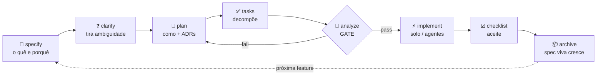

<div align="center">

# ⭐ lodestar

### A spec é a estrela que guia o seu projeto no desenvolvimento com IA.

**Spec-Driven Development (SDD) empacotado como uma skill `/sdd-init` pro [Claude Code](https://claude.com/claude-code).**
Clona, joga no `.claude` e começa a codar com IA **sem perder o controle do que ela faz**.

<br>


</div>

---

> **TL;DR** — Vibecoding sem rumo gera código que parece certo e desanda quando o projeto cresce.
> O `lodestar` faz a IA implementar **contra uma spec que é a lei**, não contra a própria imaginação.
> Funciona em micro-app e em sistema multi-tenant — ele se adapta (3 níveis).

```
            .        ⭐  lodestar          .
     .            "siga a spec, não o caos"
                  /|\
    .            / | \            .              .
                /  |  \
   spec  ──────╯   │   ╰──────  código
                   │
              (a estrela que
               te orienta)
```

---

## 📑 Sumário

- [Por que existe](#-por-que-existe)
- [O fluxo SDD](#-o-fluxo-sdd)
- [3 níveis adaptativos](#-3-níveis-adaptativos)
- [Instalação](#-instalação-onde-clonar-no-claude)
- [Como usar](#-como-usar)
- [O que tem dentro](#-o-que-tem-dentro-print-da-estrutura)
- [Exemplo real](#-exemplo-real-rodando)
- [Comparativo](#-comparativo)
- [FAQ](#-faq)
- [Créditos](#-créditos--inspiração)

---

## 🎯 Por que existe

Ferramentas de SDD existem (GitHub Spec Kit, OpenSpec, Kiro...), mas ou são pesadas demais pra um SaaS solo, ou genéricas demais pra um sistema sério. O `lodestar` pega **o melhor de cada uma** e empacota num único comando, em PT-BR:

| De onde veio | O que o lodestar herdou |
|---|---|
| 🏛️ **GitHub Spec Kit** (governance) | `constitution` + fluxo `specify → clarify → plan → tasks → analyze → implement` |
| 🔄 **OpenSpec** (continuity) | `spec.md` **viva** + `changes/` com delta specs arquivados na spec ao fechar |
| ⚙️ **Arsenal local** (execution) | pipeline multi-agente, agentes especializados, validators portáveis |

**Princípio central:** a spec é a lei, o código é consequência. Mudou regra/contrato? A spec atualiza **no mesmo PR**. A spec **nunca envelhece** — toda feature fechada é arquivada nela.

---

## 🔁 O fluxo SDD



Cada etapa tem um prompt copy-paste em [`prompts/`](prompts/). No dia a dia você só pede *"implementa a feature X"* — a skill roteia pela etapa certa e para pra clarificar quando precisa.

---

## 📊 3 níveis adaptativos

O kit **começa no menor nível que serve** e escala só quando dói. Sem overhead à toa.

| Nível | Quando usar | Gera |
|:---:|---|---|
| **N1** · micro | script, POC, micro-app | `spec.md` + `NOW.md` + `CLAUDE.md` |
| **N2** · cresceu | app real com features e deploy | N1 + `PRD` + `architecture` + `roadmap` + `summary` + `licoes` + `changes/` |
| **N3** · sistema sério | multi-tenant, time, produção | N2 + constituição equalizada + validators no CI + pipeline multi-agente |

> No **N3** o kit **delega** a infra de engenharia (CI/PR/merge/deploy) pra ferramentas dedicadas — ele não reinventa essa roda. Detalhe em [`NIVEIS.md`](NIVEIS.md).

---

## 📥 Instalação (onde clonar no `.claude`)

O kit é uma **skill global** do Claude Code. Ela precisa morar em `~/.claude/skills/sdd-init/`.

### ✅ Jeito recomendado — clone direto no lugar certo

A skill **precisa** se chamar `sdd-init` (é o nome do comando). Como o repo se chama `lodestar`, passe o nome da pasta no final do clone:

**Linux / macOS / Git Bash:**
```bash
git clone https://github.com/leonardorejani/lodestar.git ~/.claude/skills/sdd-init
```

**Windows (PowerShell):**
```powershell
git clone https://github.com/leonardorejani/lodestar.git "$env:USERPROFILE\.claude\skills\sdd-init"
```

Pronto. Abra o Claude Code em qualquer projeto e rode **`/sdd-init`**.

### 🛠️ Alternativa — instalador

Clona em qualquer lugar e roda o instalador (ele copia pro caminho certo):

```bash
git clone https://github.com/leonardorejani/lodestar.git
cd lodestar
./install.sh          # Linux/macOS/Git Bash
# ou
./install.ps1         # Windows PowerShell
```

> 💡 **Onde fica o `.claude`?** Na sua home: `~/.claude` (Linux/macOS) ou `C:\Users\<você>\.claude` (Windows). As skills ficam em `~/.claude/skills/`.

---

## 🚀 Como usar

```text
1. Abra o Claude Code na pasta do projeto
2. Rode:  /sdd-init
3. Ele detecta a stack, sugere o nível e gera os docs
4. Daí em diante:  "implementa a feature X"  → a skill conduz o fluxo
```

**Projeto novo?** Você descreve a visão (10 min) e ele gera tudo.
**Projeto já em andamento?** Ele **lê a codebase** e faz engenharia reversa dos docs — documenta o que existe, sem inventar feature nem refatorar nada.

Tutorial completo em [`GUIA.md`](GUIA.md).

---

## 📂 O que tem dentro (print da estrutura)

```text
sdd-init/
├── SKILL.md            ← cérebro do comando /sdd-init
├── GUIA.md             ← tutorial prático (passo a passo)
├── NIVEIS.md           ← regras de escalonamento N1 → N2 → N3
├── templates/          ← 9 moldes (temperados pra TS/React/Vite/Supabase)
│   ├── spec.md  ·  NOW.md  ·  PRD_v1.md  ·  architecture.md
│   ├── roadmap.md  ·  summary.md  ·  licoes.md
│   └── CLAUDE.md  ·  AGENTS.md
├── prompts/            ← 10 etapas copy-paste (00 bootstrap → 08 archive)
│   ├── 00-bootstrap-novo.md  ·  00-bootstrap-existente.md
│   ├── 01-specify  ·  02-clarify  ·  03-plan  ·  04-tasks
│   └── 05-analyze  ·  06-implement  ·  07-checklist  ·  08-archive
├── validators/
│   └── validate-encoding.cjs   ← guardrail anti-mojibake PT-BR (cross-platform)
└── examples/
    └── linkfy/         ← exemplo real preenchido (encurtador multi-tenant)
```

---

## 🎬 Exemplo real rodando

O repo traz [`examples/linkfy/`](examples/linkfy/) — um encurtador de links multi-tenant (React + Supabase) com os docs **preenchidos de verdade**. Foi o que o fluxo gera num projeto N2:

```text
examples/linkfy/docs/
├── spec.md          ← a lei: entidades, RLS fail-closed, proibições, aceite
├── PRD_v1.md        ← produto: escopo, métrica de sucesso
├── architecture.md  ← ADRs + diagrama Mermaid do redirect via Edge Function
└── NOW.md           ← a task ativa: "limite de 50 links no free plan"
```

Trecho do `spec.md` gerado (a spec vira **contrato testável**):

```markdown
## 6) Regras de negócio (não negociáveis)
- Slug é único globalmente (não por workspace).
- Link inativo retorna 404, não redireciona.
- Free plan: max 50 links por workspace.

## 8) Segurança e permissões
- RLS: fail-closed por workspace_id.
- service_role NUNCA no client.
```

Uma sessão típica no terminal do Claude Code:

```console
você ▸ /sdd-init
  ⭐ lodestar ▸ detectei: React+Vite+TS+Supabase · git ok · projeto novo
              nível sugerido: N2 (app com features + deploy). confirma?
você ▸ sim, é um encurtador de links pra times
  ⭐ gerando docs/ ... ✓ spec ✓ PRD ✓ architecture ✓ roadmap ✓ NOW ✓ CLAUDE
              gate analyze: ✓ encoding  ✓ consistência  ✓ secrets
              pronto. próximo passo:  "specify: criar link curto"
```

---

## 🆚 Comparativo

| | starter-packs minimalistas | Spec Kit / OpenSpec | **lodestar** |
|---|:---:|:---:|:---:|
| Instalação | copiar arquivos | CLI (Python/TS) | **1 skill, 1 clone** |
| Idioma | varia | EN | **PT-BR nativo** |
| Adaptativo (micro→sistema) | ❌ | parcial | **✅ 3 níveis** |
| Spec viva (não envelhece) | ❌ | ✅ (OpenSpec) | **✅** |
| Clarify + gate de consistência | ❌ | ✅ (Spec Kit) | **✅** |
| Reusa seus agentes/pipeline | ❌ | ❌ | **✅** |
| Guardrail de encoding PT-BR | ❌ | ❌ | **✅** |

---

## ❓ FAQ

<details>
<summary><b>Preciso seguir as 8 etapas sempre?</b></summary>
Não. No N1 são 3. Use o que a feature pede — só não pule o <code>analyze</code> antes de implementar em N2/N3.
</details>

<details>
<summary><b>Funciona fora da stack TS/React/Supabase?</b></summary>
Sim. Os templates vêm temperados pra essa stack, mas as seções específicas viram "N/A" em outras.
</details>

<details>
<summary><b>Vai sobrescrever meu CLAUDE.md?</b></summary>
Nunca sem te mostrar o diff e pedir ok.
</details>

<details>
<summary><b>Já uso outro framework de SDD pesado. Dá pra combinar?</b></summary>
Dá. Use o lodestar como porta de entrada leve (gera <code>spec.md</code>/<code>PRD</code>) e entregue pro seu executor de fases.
</details>

---

## 📄 Licença

[MIT](LICENSE) — use, modifique e compartilhe livremente.

<div align="center">
<br>
<sub>feito com ⭐ por <a href="https://github.com/leonardorejani">@leonardorejani</a> · siga a spec, não o caos</sub>
</div>
