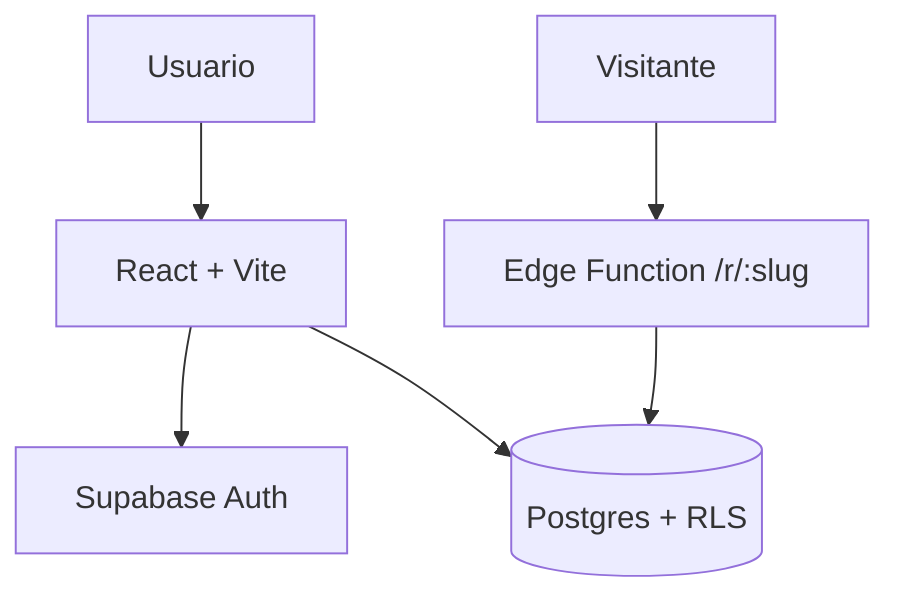

# architecture.md — Linkfy

> Decisoes arquiteturais tomadas. spec.md vence em conflito.

## 1) Visao geral
SPA React consome Supabase (Auth + Postgres via RLS). O redirect publico roda
numa Edge Function (Deno) com service_role pra registrar cliques sem expor o banco.

## 2) Diagrama de componentes

## 3) Stack e responsabilidades
| Camada | Tecnologia | Responsabilidade |
|---|---|---|
| Frontend | React+Vite+TS | UI, CRUD de links via RLS |
| API/Backend | Edge Functions (Deno) | redirect publico + contagem |
| Banco | Postgres/Supabase | links, workspaces, clicks |
| Auth | Supabase Auth | sessao, roles |

## 4) Decisoes arquiteturais (ADRs)
### ADR-001: Redirect via Edge Function (nao via SPA)
- **Contexto:** redirect precisa ser rapido, publico e contar cliques sem auth.
- **Decisao:** Edge Function `/r/:slug` com service_role server-side.
- **Consequencias:** +performance e seguranca; -uma função a manter.

### ADR-002: Slug unico global
- **Contexto:** evitar ambiguidade de roteamento.
- **Decisao:** unique constraint global em `link.slug`.
- **Consequencias:** colisao possivel -> retry com novo slug.

## 5) Fluxo de dados critico (redirect)
1. Visitante acessa `lk.fy/<slug>`.
2. Edge Function busca link ativo pelo slug (service_role).
3. Insere click_event e responde 302 pra target_url.

## 6) Seguranca arquitetural
- Multi-tenant: RLS fail-closed por `workspace_id` em todas as tabelas de usuario.
- service_role so na Edge Function, nunca no client.

## 7) Fora de escopo arquitetural
- Sem cache distribuido no MVP.
- Sem multi-region.
